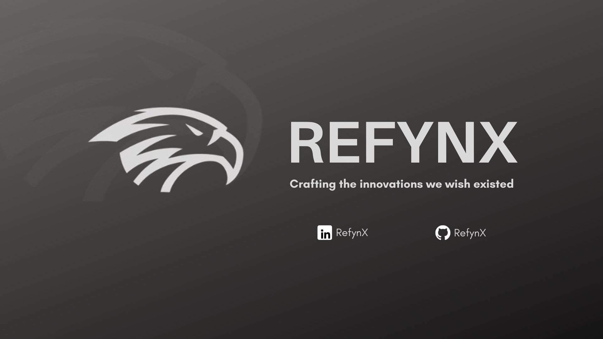

  

  <a href="https://discord.gg/Hj7r5JFgTt"></img></a>
  <a href="https://www.linkedin.com/company/refynx"></img></a>
  <a href="https://github.com/RefynX"></img></a>

RefynX is on a mission to make development easier and learning more accessible. Our journey begins with **[InCodeX](https://github.com/RefynX/InCodeX)**—a community-driven platform for developers. 

## Legal

- [Code of Conduct](../CODE_OF_CONDUCT.md)
- [Privacy Policy](../Privacy_Policy.md)
- [Contributor License Agreement](../Contributor_License_Agreement.md)
